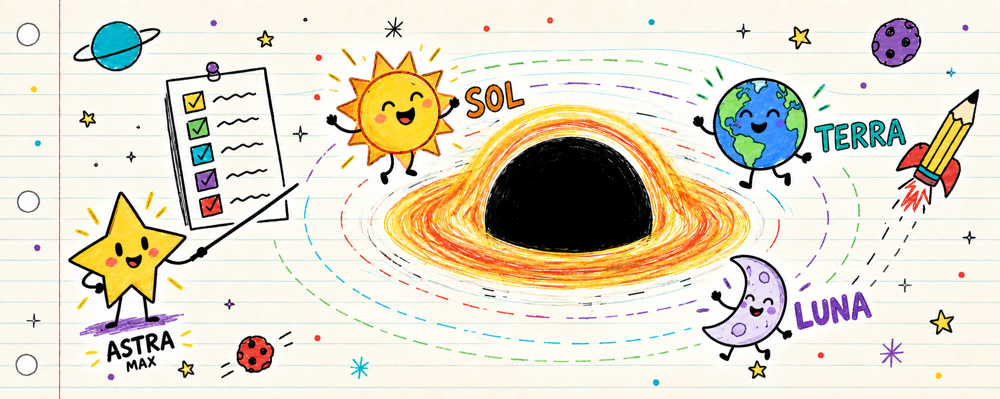

<p align="center">
  
</p>

<h1 align="center">Gravity</h1>

<p align="center">
  <em>Lean-by-design GPT-routed orchestration for Codex coding work.</em>
</p>

<p align="center">
  
  
  
  
</p>

Gravity is a Codex skill that stays active for coding work, chooses the narrowest safe mode, and delegates only when independent work justifies the overhead. It combines:

- Permission-safe orchestration with explicit side-effect boundaries.
- Hard-coded GPT routing for planner, judge, worker, and fast-loop roles.
- A task DAG informed by a fresh Graphify code graph when available and authorized.
- Always-on Ponytail smallest-clear-diff rules for coding.
- Caveman `full` compression for every applicable orchestrator and worker output.
- Product-artifact verification that composes with specialist skills.

Token economy is a design goal, not a measured performance claim. Caveman targets output prose and does not prove lower total-session usage. Gravity can stay single-agent; a swarm is a tool, not the default outcome.

## Modes

| Mode | Name | Authority |
|---|---|---|
| `/orbit` | Plan | Read-only analysis and planning; no edits, installs, or external writes. |
| `/lens` | Review | Read-only findings with evidence; no implicit fixes. |
| `/accrete` | Modify | Surgical changes to existing code plus risk-proportionate checks. |
| `/bigbang` | Create | Requested local creation; no implicit deploy or publish. |

Only these four names are valid. Without an explicit mode, Gravity maps planning to `/orbit`, review or diagnosis to `/lens`, existing-code changes to `/accrete`, and new creation to `/bigbang`. A requested review-and-fix runs `/lens` before `/accrete`.

Gravity is implicitly available for every coding task. Non-coding work activates it only when Gravity, one of the four modes, or a swarm is requested. Specialist skills keep authority over domain tools, formats, and required verification.

## Delegation and authority

Gravity builds an internal envelope with `mode`, `authority`, `scope`, `independent_lanes`, `owned_paths`, `success_criteria`, `verification`, and `stop_conditions`.

For non-trivial delegated work, Gravity converts that envelope into a directed acyclic task graph. Nodes are bounded deliverables with paths, authority, dependencies, success criteria, verification, and status. Only ready nodes run; results add evidence and unlock successors.

A fresh, already-present [`graphify-out/graph.json`](https://github.com/Graphify-Labs/graphify) can inform lane boundaries, dependency paths, and ownership. Gravity uses scoped queries or reads the JSON, treats inferred edges as hypotheses, and confirms decisions against source and tests. Graphify maps the codebase; Gravity schedules the task graph.

- Check tools, permissions, model controls, concurrency, specialist skills, repository guidance, and existing changes first.
- Stay solo unless at least two substantial lanes can run independently.
- Normally use at most two read-only scouts; add a third only for a genuine third lane and available capacity.
- Allow one writer at a time. The orchestrator writes by default; a delegated writer receives exclusive paths.
- Forbid nested spawning and pass workers only the context they need.
- Continue locally when spawning fails.
- Retry an insufficient read-only result once at the next stronger tier; inspect written work before any retry.
- Run a read-only shadow review after high-risk security, authentication, money, data, migration, or cross-area changes.

Gravity never installs, builds, updates, hooks, exposes, or writes Graphify implicitly. It sets `GRAPHIFY_QUERY_LOG_DISABLE=1` for every Graphify CLI query. A missing or stale graph is built only when Graphify is installed and the user authorized its local artifacts; otherwise Gravity falls back to repository evidence, records that fact in the receipt, and keeps using its internal DAG.

Non-trivial work ends with a compact Gravity Receipt: solo or swarm decision, checks, and residual risk.

## Hard-coded routing

| Role | Primary | Fallback |
|---|---|---|
| Planner / judge | `gpt-5.6-sol` | `gpt-5.5`, `xhigh` effort |
| Strong worker | `gpt-5.6-terra` | `gpt-5.5`, `high` effort |
| Cheap worker | `gpt-5.6-luna` | `gpt-5.5`, `low` effort |
| Fast coding loop | `gpt-5.5`, `low` effort | No lower tier |

When the runtime exposes model selection, Gravity applies these exact IDs. Otherwise it retains the intended tier in the task envelope, uses supported inheritance, and reports a deviation only when it materially affects the result. It never invents unsupported tool fields or routes below `gpt-5.5`.

## Ponytail coding contract

Ponytail stays active for every code-writing, editing, refactoring, debugging, review, testing, dependency, and architecture decision. Gravity reads the affected flow and stops at the first clear correct solution:

```text
1. Skip speculative work.
2. Reuse what already exists.
3. Prefer the standard library.
4. Prefer a native platform feature.
5. Prefer an installed dependency over a new one.
6. Use one line only when it is genuinely clearest.
7. Otherwise write the minimum clear code that works.
```

Prefer deletion over addition, boring over clever, and the fewest files possible. Non-trivial logic gets the smallest runnable regression check. Security, trust-boundary validation, data-loss protection, accessibility, hardware calibration, and explicit requirements are never simplified away. `DESIGN.md` is created only when requested, already conventional in the repository, or itself the deliverable.

## Output and delivery discipline

Gravity embeds [Caveman](https://github.com/JuliusBrussee/caveman) `full` for applicable output: concise prose in the user's language; no filler, invented abbreviations, unnecessary tool narration, decorative tables, emoji, causal arrows, or long log dumps; exact code, commands, paths, API names, errors, user copy, commits, and pull requests. Normal clarity temporarily returns for security warnings, irreversible actions, ambiguity, assumptions, authority, risks, blockers, and evidence.

[Superpowers](https://github.com/obra/superpowers) fits selectively, not as a dependency or second orchestrator. Gravity adopts root-cause debugging, independently verifiable task nodes, minimal worker context, and fresh evidence before completion. It does not import mandatory brainstorming, design files, worktrees, commits, universal TDD, or a new implementer and reviewer for every microtask.

## Validation

The focused v2 harness defines eight fresh-thread cases and reproducible fixtures in [`benchmarks/`](benchmarks/README.md), then scores check-linked evidence with [`score-v2.mjs`](benchmarks/score-v2.mjs). The checked-in [`v2-focused-unrun.json`](benchmarks/results/v2-focused-unrun.json) is an explicit template, not an 8/8 claim. The harness does not launch Codex or infer hidden behavior. Token usage remains `null` when the runtime does not expose it.

The 2026-07-06 HTML run is retained as a historical smoke check: one baseline and one Gravity output for each of three prompts. Recorded totals were 688 and 679 non-empty LOC. The sample is too small and uncontrolled to attribute behavioral, token, latency, cost, or quality effects to Gravity; token usage was not measured. See [`benchmarks/`](benchmarks/) for the method and recorded results.

## Install

From this repository, install the skill path:

```bash
python ~/.codex/skills/.system/skill-installer/scripts/install-skill-from-github.py \
  --repo VPC3vs/gravity-swarm \
  --path skills/gravity
```

On Windows PowerShell:

```powershell
python "$env:USERPROFILE\.codex\skills\.system\skill-installer\scripts\install-skill-from-github.py" `
  --repo VPC3vs/gravity-swarm `
  --path skills/gravity
```

Or copy `skills/gravity` into `~/.codex/skills/gravity`, then restart Codex if the update is not detected automatically.

## What ships

```text
skills/gravity/SKILL.md
skills/gravity/agents/openai.yaml
assets/gravity-banner.png
benchmarks/
```

## Credit

Gravity was shaped around public ideas from [Caveman](https://github.com/JuliusBrussee/caveman), Ponytail, Open Design, [Graphify](https://github.com/Graphify-Labs/graphify), [Superpowers](https://github.com/obra/superpowers), and a local Ogre-style orchestrator skill. The banner is original derpy paint-style art generated for this repo.
